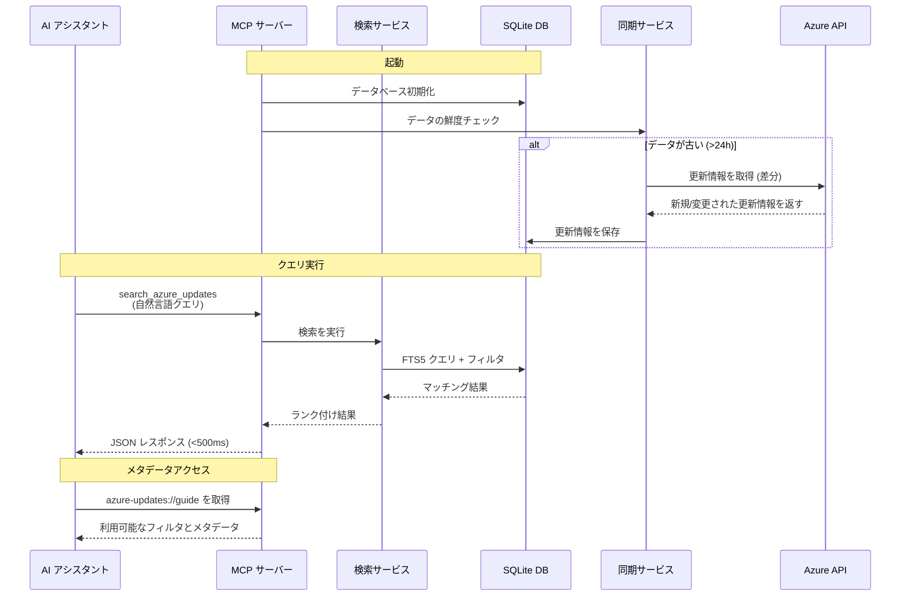

# Azure Updates MCP Server

AI アシスタントが Azure サービスの更新情報、廃止予定、機能発表にシームレスにアクセスできる MCP (Model Context Protocol) サーバーです。

[](https://www.typescriptlang.org/)
[](https://nodejs.org/)
[](./LICENSE)

## 機能

- 🔍 **優れたキーワードマッチング** - BM25 関連性ランキングによるタイトルと説明の全文検索（元の API ではタイトルの検索のみ）
- 🎯 **フィルタリング・ソート機能** - タグ、カテゴリ、製品、日付、ステータスでフィルタリングし、更新日でソート
- ⚡ **高速レスポンス** - ローカル SQLite レプリケーションにより 500ms 未満のクエリレスポンスタイム
- 🔄 **自動同期** - 差分同期でデータを最新に保つ(設定可能な間隔、デフォルト 24 時間)
- 📊 **ヘルプリソース** - AI がクエリを構築するために利用可能なすべてのフィルタとデータの鮮度を公開

## セットアップ

**ステップ 1: tarball パッケージの取得**

内部配布チャネルから `azure-updates-mcp-server-{version}.tgz` を入手してください。

**ステップ 2: グローバルインストール**

```bash
npm install -g ./azure-updates-mcp-server-{version}.tgz
```

**ステップ 3: MCP サーバーの起動**

`azure-updates-mcp-server` コマンドで MCP サーバーを起動できます。VS Code を使用している場合、以下の設定 (`.vscode/mcp.json`) でサーバーを起動します:

```jsonc
{
  "servers": {
    "azure-updates-mcp": {
      "command": "azure-updates-mcp-server",
      // 以下の環境変数はオプションです。必要に応じて設定してください
      // "env": {
      //   "DATABASE_PATH": "${workspaceFolder}/.azure-updates/data.db",
      //   "SYNC_STALENESS_HOURS": "24",
      //   "LOG_LEVEL": "info"
      // }
    }
  }
}
```

> **⚠️ 注意**: 初回起動時にはローカルキャッシュへのデータ同期が行われるため、検索できるようになるまで数分かかる場合があります。同期が完了すると、以降のクエリは高速に応答します。

### 代替方法: npx を使用

グローバルインストールせずに `npx` で実行することもできます:

```jsonc
{
  "servers": {
    "azure-updates-mcp": {
      "command": "npx",
      "args": ["~/azure-updates-mcp-server-{version}.tgz"],
    }
  }
}
```

## 使い方

AI アシスタントに自然言語クエリとオプションのフィルタを使って `search_azure_updates` ツールを使うよう依頼するだけです。

```txt
2025 年 1 月以降の OAuth 認証に関連する最新のセキュリティ更新情報を 10 件まで教えてください。
```

アシスタントが自動的に適切なパラメータを構築し、次のように MCP サーバーを呼び出します:

```json
{
  "tool": "search_azure_updates",
  "parameters": {
    "query": "OAuth authentication security",
    "filters": {
      "tags": ["Security"],
      "dateFrom": "2025-01-01"
    },
    "limit": 10
  }
}
```

GitHub Copilot 用のサンプルエージェント定義は以下にあります:

- [.github/agents/azupdates.retire.agent.md](./.github/agents/azupdates.retire.agent.md)
- [.github/agents/azupdates.update.agent.md](./.github/agents/azupdates.update.agent.md)

## 設定

設定は環境変数で行います。`.env` ファイルを作成するか、環境変数を設定してください:

| 変数 | デフォルト | 説明 |
|----------|---------|-------------|
| `DATABASE_PATH` | `~/.azure-updates-mcp/azure-updates.db` | SQLite データベースのパス |
| `SYNC_STALENESS_HOURS` | `24` | この時間より古いデータの場合に同期 |
| `SYNC_ON_STARTUP` | `true` | 起動時の同期チェックを有効/無効化 |
| `DATA_RETENTION_START_DATE` | `2022-01-01` | この日付以降の更新情報を保持 (ISO 8601: YYYY-MM-DD) |
| `LOG_LEVEL` | `info` | ログレベル: debug, info, warn, error |
| `LOG_FORMAT` | `json` | ログフォーマット: json または pretty |

すべての設定オプションは [.env.example](./.env.example) を参照してください。

## 利用可能なツール

### 2 ツールアーキテクチャ

このサーバーは、効率的な検索と詳細取得のための2ツールパターンを提供します:

#### 1. `search_azure_updates` - 軽量な検索

Azure 更新情報を検索・フィルタリングして関連するアイテムを見つけます。**メタデータのみ**を返し(説明文なし)、トークン使用量を 80% 削減します。

**主な機能:**
- **フレーズ検索**: 引用符で完全一致フレーズを検索 (`"Azure Virtual Machines"`)
- **FTS5 検索**: BM25 関連性ランキングでタイトル+説明を検索
- **構造化フィルタ**: タグ、製品、カテゴリ (AND 演算)、日付、ステータス
- **ソート**: 更新日、作成日、廃止日、関連性でソート

**例:**
```json
{
  "query": "OAuth authentication security",
  "filters": {
    "tags": ["Security"],
    "productCategories": ["Compute"],
    "dateFrom": "2025-01-01"
  },
  "limit": 10
}
```

#### 2. `get_azure_update` - 完全な詳細情報

Markdown 形式の完全な説明文と URL を含む、更新情報の全詳細を取得します。

**例:**
```json
{
  "id": "536699"
}
```

**推奨ワークフロー:**
1. `search_azure_updates` で関連する更新情報を検索
2. `get_azure_update` で選択したアイテムの完全な詳細を取得

その他の例については、`azure-updates://guide` リソース (MCP プロトコルを通じて配布) を参照してください。

## アーキテクチャ



FTS5 全文検索を備えたローカル SQLite レプリケーションにより、高速クエリ (<500ms) を提供します。差分同期により Azure Updates API からデータを最新に保ちます。

**技術スタック:**
- **MCP SDK**: `@modelcontextprotocol/sdk`
- **データベース**: `better-sqlite3` with FTS5
- **テスト**: Vitest with TypeScript strict mode
- **ランタイム**: Node.js 18+

## 開発

セットアップ、テスト、コントリビューションの手順については [開発ガイド](./docs/development.md) を参照してください。

## トラブルシューティング

一般的な問題と解決策については [トラブルシューティングガイド](./docs/troubleshooting.md) を参照してください。

## ドキュメント

- [開発ガイド](./docs/development.md) - コントリビューションとテスト
- [トラブルシューティング](./docs/troubleshooting.md) - 一般的な問題
- [MCP ベストプラクティス](./docs/mcp-best-practices.md) - ツール設計ガイドライン
- [Azure Updates API マニュアル](./docs/azure-updates-api-manual.md) - API リファレンス

## ライセンス

MIT ライセンス - 詳細は [LICENSE](./LICENSE) ファイルを参照してください。
