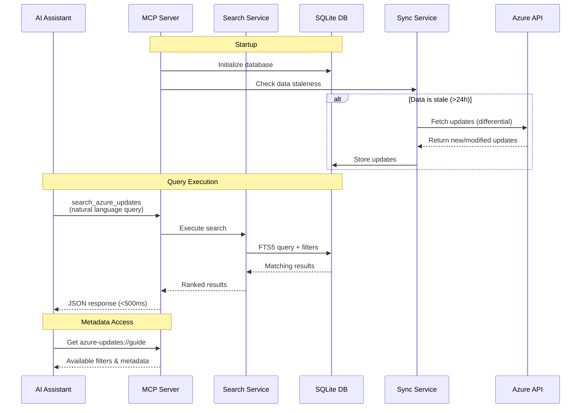

# Azure Updates MCP Server

An MCP (Model Context Protocol) server that provides AI assistants with seamless access to Azure service updates, retirements, and feature announcements.

[](https://www.typescriptlang.org/)
[](https://nodejs.org/)
[](./LICENSE)

> Japanese version: [README.ja.md](./README.ja.md)

## Features

- 🔍 **Better Keyword Matching** - Full-text search (FTS5) across titles and descriptions with BM25 relevance ranking, offering improved query search than the original API.
- 🎯 **Simplified Filtering** - Filter by tags, categories, products, dates, and status—no OData knowledge needed.
- ⚡ **Fast Response** - Local SQLite replication ensures <500ms query response times.
- 🔄 **Automatic Sync** - Differential synchronization keeps data fresh (configurable interval, default 24h).
- 📊 **Help Resource** - Expose all available filters and data freshness to help AI construct queries.

## Legal Notice

⚠️ **Important**: This server accesses the Azure Updates API, which is subject to [Microsoft APIs Terms of Use](https://learn.microsoft.com/en-us/legal/microsoft-apis/terms-of-use). By using this software, you agree to:

- Comply with all applicable Microsoft API terms and conditions
- Not use the data for advertising or marketing purposes
- Implement appropriate data protection measures
- Respect Microsoft's intellectual property rights

This software is provided under the MIT License for the code implementation only. The data accessed through the Azure Updates API remains subject to Microsoft's terms.

**Additional Resources:**
- API Usage Policies: [docs/azure-updates-api-manual.md](./docs/azure-updates-api-manual.md)
- Privacy Statement: [docs/PRIVACY.md](./docs/PRIVACY.md)

## Setup

### Option 1: Global Installation (Recommended)

Install globally from GitHub:

```bash
npm install -g github:juyamagu/azure-updates-mcp-server
```

Then configure VS Code (`.vscode/mcp.json`):

```jsonc
{
  "servers": {
    "azure-updates": {
      "command": "azure-updates-mcp-server"
      // Optional environment variables:
      // "env": {
      //   "DATABASE_PATH": "${workspaceFolder}/.azure-updates/data.db",
      //   "SYNC_STALENESS_HOURS": "24",
      //   "LOG_LEVEL": "info"
      // }
    }
  }
}
```

> **⚠️ Note**: On the first run, data synchronization to the local cache will occur, which may take a few minutes before search queries can be served. Once synchronization is complete, subsequent queries will respond quickly.

### Option 2: Using npx

For quick testing without installation:

```jsonc
{
  "servers": {
    "azure-updates": {
      "command": "npx",
      "args": ["-y", "github:juyamagu/azure-updates-mcp-server"]
    }
  }
}
```

> **Note**: npx caches packages which may consume more disk space over time. Global installation is recommended for regular use.

## Usage

All you need is to ask your AI assistant to use the `search_azure_updates` tool with natural language queries and optional filters. 

```txt
What are the latest security updates related to OAuth authentication in Azure since January 2025? Up to 10 results, please.
```

Your assistant automatically constructs the appropriate parameters and calls the MCP server like this:

```json
{
  "tool": "search_azure_updates",
  "parameters": {
    "query": "OAuth authentication security",
    "filters": {
      "tags": ["Security"],
      "dateFrom": "2025-01-01"
    },
    "limit": 10
  }
}
```

Sample agent definitions for GitHub Copilot can be found in:

- [.github/agents/azupdates.retire.agent.md](./.github/agents/azupdates.retire.agent.md)
- [.github/agents/azupdates.update.agent.md](./.github/agents/azupdates.update.agent.md)

## Configuration

Configuration is done via environment variables. Create a `.env` file or set environment variables:

| Variable | Default | Description |
|----------|---------|-------------|
| `DATABASE_PATH` | `~/.azure-updates-mcp/azure-updates.db` | Path to SQLite database |
| `SYNC_STALENESS_HOURS` | `24` | Sync if data older than this many hours |
| `SYNC_ON_STARTUP` | `true` | Enable/disable startup sync check |
| `DATA_RETENTION_START_DATE` | `2022-01-01` | Retain updates from this date onwards (ISO 8601: YYYY-MM-DD) |
| `LOG_LEVEL` | `info` | Log level: debug, info, warn, error |
| `LOG_FORMAT` | `json` | Log format: json or pretty |

See [.env.example](./.env.example) for all configuration options.

## Available Tools

### Two-Tool Architecture

This server provides a two-tool pattern for efficient discovery and detail retrieval:

#### 1. `search_azure_updates` - Lightweight Discovery

Search and filter Azure updates to find relevant items. Returns **metadata only** (no descriptions) for 80% token reduction.

**Key Features:**
- **Phrase search**: Use quotes for exact phrases (`"Azure Virtual Machines"`)
- **FTS5 search**: Searches title + description with BM25 relevance ranking
- **Structured filters**: Tags, products, categories (AND semantics), dates, status
- **Sorting**: By modified/created date, retirement date, or relevance

**Example:**
```json
{
  "query": "OAuth authentication security",
  "filters": {
    "tags": ["Security"],
    "productCategories": ["Compute"],
    "dateFrom": "2025-01-01"
  },
  "limit": 10
}
```

#### 2. `get_azure_update` - Full Details

Retrieve complete update details including full Markdown description and URL.

**Example:**
```json
{
  "id": "536699"
}
```

**Recommended Workflow:**
1. Use `search_azure_updates` to find relevant updates
2. Use `get_azure_update` to fetch full details for selected items

For more examples, see the `azure-updates://guide` resource (distributed through MCP protocol).

## Architecture



Local SQLite replication with FTS5 full-text search provides fast queries (<500ms). Differential sync keeps data fresh from Azure Updates API.

**Technology Stack:**
- **MCP SDK**: `@modelcontextprotocol/sdk`
- **Database**: `better-sqlite3` with FTS5
- **Testing**: Vitest with TypeScript strict mode
- **Runtime**: Node.js 18+

## Development

See [Development Guide](./docs/development.md) for setup, testing, and contributing instructions.

## Troubleshooting

See [Troubleshooting Guide](./docs/troubleshooting.md) for common issues and solutions.

## Documentation

- [Installation from Tarball](./docs/installation-from-tarball.md) - Package-based installation
- [Troubleshooting](./docs/troubleshooting.md) - Common issues
- [Development Guide](./docs/development.md) - Contributing and testing
- [Azure Updates API Manual](./docs/azure-updates-api-manual.md) - API reference

## License

MIT License - see [LICENSE](./LICENSE) file for details.
